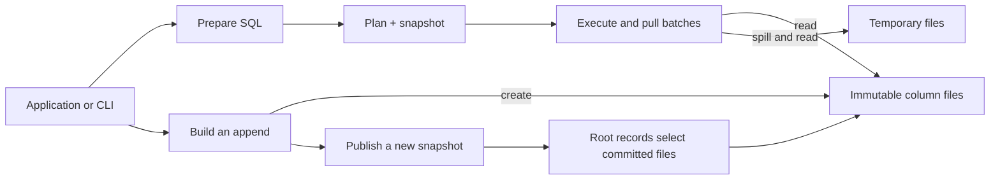

# Architecture

PipeSQL turns local data into analytical reports. An application writes typed
batches of rows, prepares a pipe query, and pulls the answer in batches. The engine
runs inside that application. There is no server between the caller and the files,
and no background worker pool: calling `step` advances the query on the caller's
thread.

Two problems shape the design. A report may need more data than fits in memory.
A write may stop at any point, including after it has committed but before the
caller learns that it succeeded. The execution engine handles the first problem
with bounded buffers and disk-backed algorithms. The storage engine handles the
second with immutable data, explicit publication, and recoverable write identities.



## A query reads one version

A report should not read half of an import. Preparing a query therefore selects
one committed catalog, which describes the tables and the files containing their
rows. The prepared query holds a *snapshot pin*: an ownership claim that keeps
that catalog and its data available.

A generation identifies a successful publication. Consider a report prepared at
generation 7 while another caller appends new rows. The writer constructs new
files and publishes generation 8. The original report
still reads generation 7, even if execution begins after the append. A newly
prepared report reads generation 8. Reclamation, the removal of unused stored
objects, cannot remove generation 7's files until its last reader lets go.

This separates two responsibilities. A snapshot pin protects readable data; writer
admission grants permission to publish a replacement. Holding a snapshot does not
mean holding a mutex through the query. Short registry changes use a mutex, while
file I/O happens outside it. One admitted writer can coexist with readers. The
registry has finite capacity, so keeping many versions alive can prevent a writer
from obtaining another slot.

The cost is retained storage: old files remain necessary while an old reader needs
them. The benefit is a stable input without copying the database or coordinating
individual row updates with a scan. [Embedding](embedding.md#keep-a-snapshot)
explains the caller's lifetime choices.

## Store columns; exchange batches

Analytical queries often read many rows but only a few columns. A native data unit
therefore stores columns separately. Its metadata identifies the columns and
records the location and checksum of each column's data, called its payload.
A scan of `amount` need not allocate buffers for an unrelated text column.

Columns remain typed throughout execution: INT64, DOUBLE, STRING, or DATE, with
NULL tracked separately. A zero and a missing value are different inputs. DOUBLE
storage preserves its bits, including signed zero and NaN (not-a-number). Each
SQL operation defines how those values compare or calculate.

Operators exchange batches of up to 256 rows. Processing several rows per operator
call reduces overhead without requiring a complete table in memory. A result
batch borrows reusable buffers. The caller must consume it before requesting the
next batch; copying a result into application-owned storage is an explicit choice.

Metadata and column payloads have separate checksums. That makes selective reads
possible, but also limits what validation establishes. Opening a database checks
the selected metadata graph. It does not certify every payload in every column.
A demanded payload is checked before its values reach an evaluator.

## Separate meaning from placement

SQL names are not buffer positions. In this query, renaming a column changes how
it can be addressed; adding one creates a different value:

```sql
FROM sales
|> RENAME amount AS original
|> EXTEND original + 1 AS adjusted
|> AGGREGATE SUM(adjusted) AS total
```

Preparation resolves names and types and assigns column identities. A direct
reference can retain an identity through a change of name or position. A computed
value receives its own identity. This distinction matters when projections drop,
repeat, or reorder columns, and when sorting must retain a key hidden from output.

Execution planning maps those identities to positions in physical batches. It
also determines which values the result actually needs. Both the logical plan
and the physical mapping are validated before execution trusts them. Physical
construction and validation share demand analysis, so their agreement alone does
not prove that demand is correct. Independent result and error cases test that
part of the design.

Planning chooses among implemented strategies; it is not a cost-based optimizer.
The [execution chapter](execution.md) follows the report through these stages.

## Reserve enough to make progress

Every operation shares the database's memory and temporary-space accounts. An
owner reserves capacity before obtaining its storage and returns the charge only
after releasing that storage. Replacement buffers must account for their overlap
with the buffers they replace.

A spill path needs memory too: at least enough to encode rows, read and write runs,
and compare or combine them. Grouping reserves this fallback before spending
optional memory on a hash table. Otherwise filling the fast path could leave no
space to escape from it.

When data exceeds memory, the sorter writes sorted chunks, called *runs*, and
merges them through two temporary files. Grouping, joins, duplicate removal, set
operations, and windows reuse this mechanism. They retain separate rules for
which rows match and what answer to produce. Sharing the sorter must not make a
join treat NULL like a grouping key.

These accounts are not a process-memory limit. Allocator overhead, retained pages,
thread stacks, and caller-owned buffers are separate costs. [Resource limits](embedding.md#budget-the-live-work)
explain how this affects an application.

## Construct first; publish once

An append writes private files. Successful `write` calls mean those batches were
accepted into the attempt; they do not make the rows visible. Commit verifies and
synchronizes the completed graph before changing the root records that select it.

Publication replaces two roots in sequence, with synchronization between them.
An interruption can leave different roots, so recovery needs rules for deciding
which transition they support. The WAL records the attempted transition but does
not independently authorize replay. [Storage](storage.md) explains that decision.

The writer issues a transaction token before building data. If a failure occurs
after publication may have begun, the caller retains that token, reopens the
database, and asks whether the attempt committed. Reporting every error as an
abort would make a retry capable of duplicating rows. The interface preserves
uncertainty so the caller can resolve the attempt before retrying.

## Completion is an observable event

Returning rows does not finish a report. A later read, computation, or output
write can fail. The result cursor distinguishes rows, progress, completion, and
failure; only completion establishes a complete answer. Exports carry this rule
through their final record or footer and the writer's flush.

Likewise, dropping a query releases its execution resources but does not complete
it. Dropping an unfinished writer closes its owners without attempting rollback
I/O; the database requires recovery. Cancellation requests are observed between
bounded steps and cannot interrupt an arbitrary blocked system call.

## Boundaries in the code

The library owns query meaning and database state. The CLI translates paths,
options, and streams into library calls. The private filesystem crate supplies
native operations; it cannot decide which snapshot is authoritative or which
files may be deleted. The engine forbids unsafe Rust, while the filesystem and
CLI confine their required native work to narrow boundaries.

Begin reading at [database.rs](../src/database.rs). Follow
[query](../src/query.rs) for preparation,
[execution](../src/execution.rs) for results, and
[snapshots](../src/storage/snapshot.rs) for readers and writers.
The separate [development runner](../dev/README.md) supervises tests and calculates
independent answers; it is not part of the engine.

The legacy `lineitem` loader remains a separate fixed-schema storage path. It
shares SQL and result interfaces but does not support every declared-table
operator or reader/writer overlap. It is retained for the existing workload,
not presented as the architecture for new tables.
